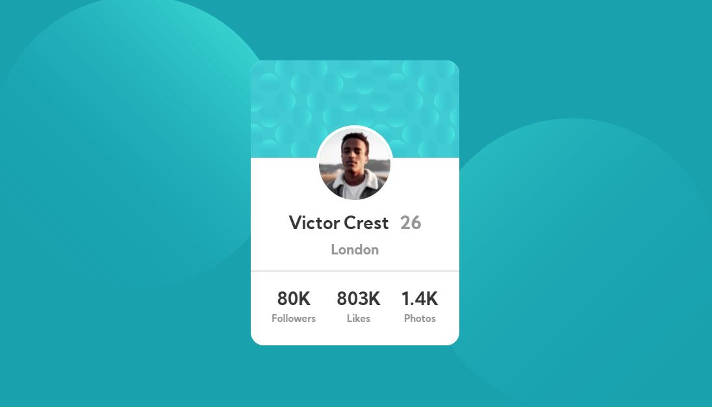

# Frontend Mentor - Profile card component solution

This is a solution to the [Profile card component challenge on Frontend Mentor](https://www.frontendmentor.io/challenges/profile-card-component-cfArpWshJ). Frontend Mentor challenges help you improve your coding skills by building realistic projects. 

## Table of contents

- [Overview](#overview)
  - [The challenge](#the-challenge)
  - [Screenshot](#screenshot)
- [My process](#my-process)
  - [Built with](#built-with)
  - [What I learned](#what-i-learned)
  - [Continued development](#continued-development)
  - [Useful resources](#useful-resources)
- [Author](#author)
- [Acknowledgments](#acknowledgments)

**Note: Delete this note and update the table of contents based on what sections you keep.**

## Overview

### The challenge

- Build out the project to the designs provided

### Screenshot

## My process

### Built with

- Semantic HTML5 markup
- CSS custom properties
- CSS Grid
- Mobile-first workflow

### What I learned
There are many ways to position the profile picture between two divs. One of the ways to accomplish it is to use negative values for the margin-top: 

.card-profile-frame {
    margin: -50px auto 20px;
}

### Continued development

CSS Positioning is an art but I am still learning how to position elements in css. 

### Useful resources

- [Example resource 1](https://www.youtube.com/watch?v=vjObtWO5RvU&t=1314s&ab_channel=CodingSections) - This helped me for positioning the profile picture

## Author

- Frontend Mentor - [@bryanbandela](https://www.frontendmentor.io/profile/bryanbandela)

## Acknowledgments
I am really greateful for Coding Sections (Youtube channel). His tutorial really helped a lot and I have learned quite a lot.